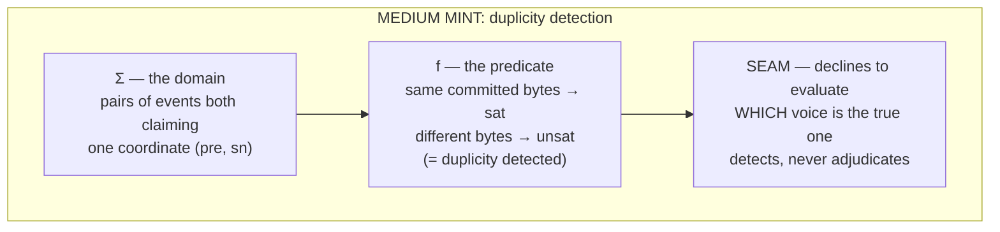
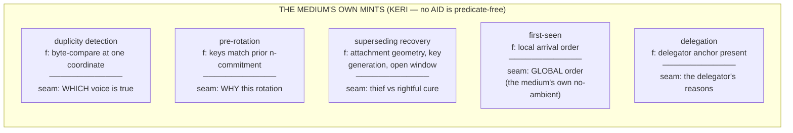
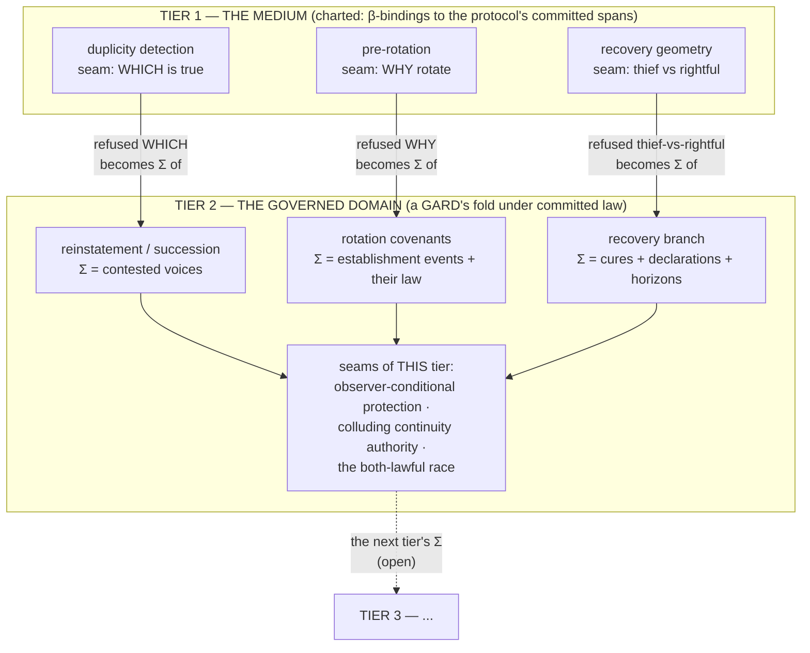

# The composition law

**Tiers compose at seams: what one tier of authority declines to
answer is exactly the domain of the tier above it.**

This is the kernel's one law of its own. It was not designed; it
was noticed — the sentence "KERI detects; a GARD adjudicates"
turned out to be an instance of it, and then every other tier
boundary in the running artifacts turned out to be another.

## The anatomy of one mint

The seam is not a failure. It is a committed jurisdiction
statement: *this question exists, and it is not mine.*

## The five medium mints

These five are charted, never legislated: each is a β-binding to
the protocol's committed behavior, descriptive and convictable if
misread. The kernel does not mint at the root; it charts the root.

## The tower

Reading the picture: the horizontal cut between tiers is the
detect/adjudicate boundary, an instance of the law rather than a
special arrangement. "Grounding up, governing down" is the arrows'
two directions — the lower tier's seams supply the upper tier's
domains; the upper tier's committed law pins predicates downward.
The tower does not stop: tier 2 has its own confessed seams, and
they are exactly where a third tier would begin. A deferral to
future machinery (leaving a question at a tier's seam) is a lawful
move under this law — the question sits outside the tier's Σ,
waiting for the tier that ranges over it — and is distinct from
silently evaluating it, which is the overclaim defect.

## The tower in other sciences

Three independent traditions found this shape before we did. They
are cited as structural echoes, never imported authority — each
seat is an argument that the law is real, none is a proof.

- **Institutional analysis (Ostrom).** The three levels of rules —
  operational (acts within rules) ⊂ collective-choice (how
  operational rules change) ⊂ constitutional (how collective-choice
  rules change) — with the key structural finding: **rule change at
  level n is governed at level n+1**. That is the composition law
  discovered empirically, in irrigation systems and fisheries: each
  level's un-answerable question (may this rule change?) is exactly
  the next level's domain. The tower has field data.
- **Mathematical logic (Gödel, Tarski, Turing, Nash).** Truth at
  level n is definable only at n+1 (Tarski); consistency at level n
  is provable only at n+1 (Gödel); the tower of consistency
  extensions is Turing's 1939 ordinal-logics program. A tier's seam
  is the independence phenomenon in governance clothing — duplicity's
  "which voice is true" is undecidable at the medium in exactly the
  sense Con(T) is undecidable in T: not unknown, outside the tier's
  expressive competence. The open top is the incompleteness theorem's
  governance form. Nash's unfinished "Hierarchical Introspective
  Logics" (1990s) states the authority structure in two sentences —
  "a logical system cannot effectively state its own consistency…
  but one logical system CAN easily state the formal consistency of
  another" — self-binding-never-self-judged, in proof theory. His
  indexing move (levels indexed by committed *definitions* of
  ordinals, not by the ideal ordinals themselves, accepting that the
  ideals outrun every naming scheme) is the commitment-grounding
  maneuver: the tractable object is the committed description; the
  ideal is a direction.
- **The special-case theorem.** The logical towers are HOMOGENEOUS:
  every level's seam is the same question — "is the level below
  consistent/true?" — iterated transfinitely, which is why the
  levels need ordinal-shaped names at all. This tower is
  HETEROGENEOUS: each tier's seam is a different question
  (which-voice / why-this-rotation / thief-vs-rightful), so
  composition is finite and typed. Hierarchical introspective logic
  is the special case of seam-composition where every seam is the
  consistency question.
- **The termination trichotomy.** The logical tower cannot
  terminate (self-proof is forbidden — the regress is infinite by
  theorem). Ostrom's tower terminates *empirically*, leaning on an
  un-formalized exterior (shared norms maintaining the
  constitutional level). This tower terminates **by construction,
  at a genesis knot** — lawful where self-proof is not, because the
  demand shifts: the root never proves itself true; it declares
  itself checkable. Consistency-proof is barred; commitment is not.
  The regress dies because the question changed from
  truth-grounding to commitment-grounding.
- **Game theory, one note.** Where two lawful branches compete (the
  both-lawful race), committed law functions as a correlation
  device in Aumann's sense: a public committed signal letting
  independent verifiers converge on one branch without
  communicating — because they all fold the same bytes. A
  constitution's game-theoretic type is not a contract but a
  correlated-equilibrium device with arithmetic in place of the
  mediator.

## Corollaries

- **A confessed seam is load-bearing.** Dropping a seam in
  compression is how overclaims are born; every projection of a
  mint carries its seam or is a defective binding.
- **Seam inventories predict architecture.** The set of questions
  a tier refuses is the requirements document for the tier above
  it — written by the refusals, not by a designer.
- **The tower is open at the top by construction.** The top tier's
  seams are always someone's future domain. A tower with a closed
  top has either answered every question (false for any real
  system) or silently evaluated some (the defect).
