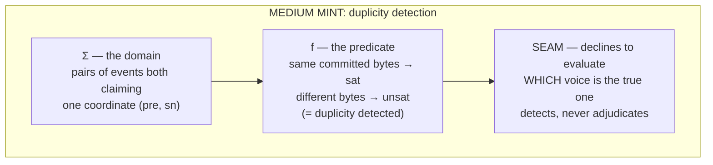
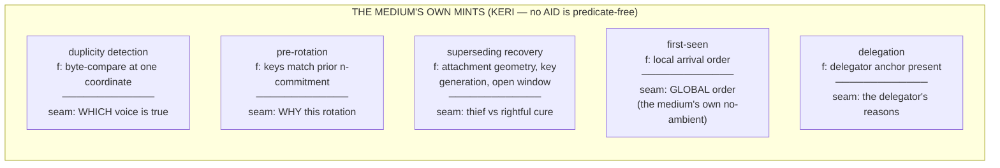
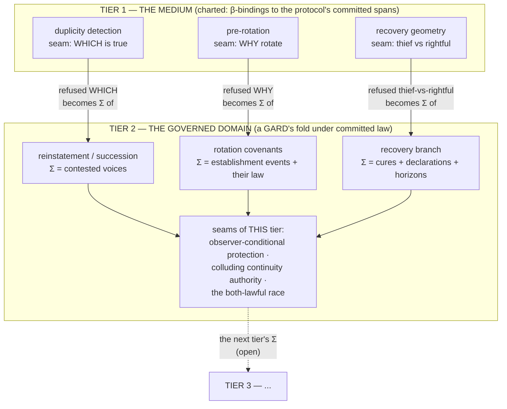

# The composition law

**Tiers compose at seams: what one tier of authority declines to
answer is exactly the domain of the tier above it.**

This is the kernel's one law of its own. It was not designed; it
was noticed — the sentence "KERI detects; a GARD adjudicates"
turned out to be an instance of it, and then every other tier
boundary in the running artifacts turned out to be another.

## The anatomy of one mint

The seam is not a failure. It is a committed jurisdiction
statement: *this question exists, and it is not mine.*

## The five medium mints

These five are charted, never legislated: each is a β-binding to
the protocol's committed behavior, descriptive and convictable if
misread. The kernel does not mint at the root; it charts the root.

## The tower

Reading the picture: the horizontal cut between tiers is the
detect/adjudicate boundary, an instance of the law rather than a
special arrangement. "Grounding up, governing down" is the arrows'
two directions — the lower tier's seams supply the upper tier's
domains; the upper tier's committed law pins predicates downward.
The tower does not stop: tier 2 has its own confessed seams, and
they are exactly where a third tier would begin. A deferral to
future machinery (leaving a question at a tier's seam) is a lawful
move under this law — the question sits outside the tier's Σ,
waiting for the tier that ranges over it — and is distinct from
silently evaluating it, which is the overclaim defect.

## Corollaries

- **A confessed seam is load-bearing.** Dropping a seam in
  compression is how overclaims are born; every projection of a
  mint carries its seam or is a defective binding.
- **Seam inventories predict architecture.** The set of questions
  a tier refuses is the requirements document for the tier above
  it — written by the refusals, not by a designer.
- **The tower is open at the top by construction.** The top tier's
  seams are always someone's future domain. A tower with a closed
  top has either answered every question (false for any real
  system) or silently evaluated some (the defect).
