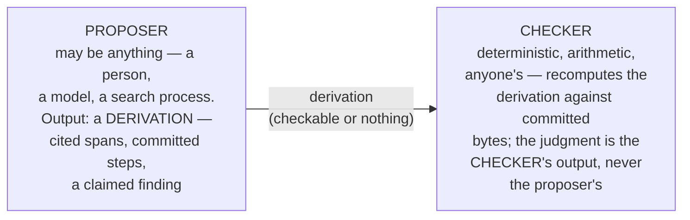

# The evaluation law

**Evaluation is deterministic. Anything probabilistic enters only
at the proposer seat, and a proposer's output arrives as a
checkable derivation or it does not arrive.**

Ruled 2026-08-10 ("the goal is deterministic governance
vectors/tensors"), killing a false fork: a proposed regime in
which model-computed judgment carried a permanent apparatus
confession was a category error — a probabilistic fold is not a
nonconforming engine with an excuse; it is not an engine. The
governed standard had already committed the evaluator's type
boundary (return type, refusal rule, determinism); this law
restates it at kernel grade.

## The two seats

The mast is arithmetic; the crew is anyone. An occupant of an
evaluator's office can be non-human precisely because the office's
accountability is structural — its acts are judged by deterministic
law any stranger can run. An intelligence judged by another
intelligence's unverifiable judgment is a regress; an intelligence
judged by committed arithmetic is an occupant.

Scaffolding-era practice does not type the kernel: that a standard
is DRAFTED by interpretive folds (people, models, dialogue) is the
construction site, not the architecture. Nobody writes the crane
into the building's load calculations.

## The binding's citation discipline (era-graded)

A record carries the coordinate of the binding that computed it —
which engine, which parameters, which frame. Two laws of different
lifetimes govern that coordinate:

1. **Inertness — eternal.** The coordinate is cited, never
   consumed: a fold that reads its own binding coordinate as
   evidence has violated the closed triple. Inertness is
   vector-tested (the reversal condition: flip the coordinate,
   the finding must not move).
2. **Citation-necessity — graded by denotation completeness.**
   While a predicate's f is prose-denoted, interpretation lives in
   the evaluator, and naming the interpretive apparatus is honest
   confession — required. As the denotation closes (a clause
   language making f machine-evaluable), the coordinate dwindles
   from confession to diagnostic convenience: in the limit, any
   stranger recomputes, and the finding needs no witness — not
   even the name of who computed it. The implementability census
   of a registry is literally the map of where citation is still
   load-bearing.

The limit is a direction (the two-move discipline): findings that
carry no binding because the geometry is intrinsic to the
committed bytes. The coordinate is the current fragment.

## Why the geometry is intrinsic, never ambient

The conformance geometry of a committed corpus travels WITH the
bytes: derivable by anyone, held by no one. This is the exact
inverse of ambient context (uncommitted state, held somewhere,
changing results), and the two must never be conflated — the
"it's just there" texture is the same; the provenance is opposite.
Intrinsic = commitment put it there. Ambient = context leaked in.
